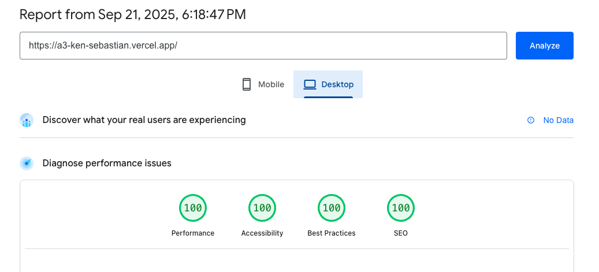

# Readme
## Patient Record System

Application link: https://a3-ken-sebastian.vercel.app/

- This app is designed for doctors to keep track of their patient records
- Biggest challenges I overcame in this project
  - GitHub authentication using OAuth was tricky
  - Combining GitHub authentication with regular username/password authentication was the most time-consuming part
  - Implementing persistent data storage using MongoDB
  - Modifying the create, update, and delete functionalities to work with the database
- I used GitHub authentication because I thought it would be good to learn how to implement OAuth
- I used TailwindCSS; no particular reason why, it's just a popular framework and I've had no experience with any frameworks
  - I kept all the original CSS from assignment 2 for my data display page, only using Tailwind for the login screen
- Express middleware packages and custom functions used:
  - **express.static**: Serves static files (HTML, CSS, and JS files) directly from the public directory.

  - **express.json**: Parses request bodies with Content-Type application/json, making the data available on req.body.

  - **express.urlencoded**: Parses incoming request bodies from HTML forms, making the form data available on req.body.

  - **express-session**: Creates a session for each user, allowing the server to remember them using a cookie.

  - **passport.initialize**: Initializes the Passport.js authentication middleware in Express.

  - **passport.session**: Allows Passport to use the express-session to maintain a persistent login state for users.

  - **isLoggedIn** (custom function): checks if a user is authenticated 
  
  - **isAuthenticated** (custom function); if authenticated, allows the request to continue to the intended route; else, it redirects them to the login page (/).

## Technical Achievements
- **Tech Achievement 1** (10 pts): I used OAuth authentication via the GitHub strategy
- **Tech Achievement 2** (5 pts): I deployed the site on Vercel. There were no downsides that I noticed compared to Render. Vercel was better than Render in autodeploying when there were new pushes, and it also seemed to deploy quicker than Render.
- **Tech Achievement 3** (5 pts): Achieved 100% on all the Lighthouse tests for the login and display pages

### Design/Evaluation Achievements
- **None**

## Tools Used
- **Bootstrap**
  - For GitHub icon
- **Tailwind CSS**
  - CSS Framework for styling of Login Page
- **Google Gemini**
  - Debugging code
  - Styling suggestions
    - Tabs for Login page (Sign in / Create account)

- **GitHub Copilot**
  - Autocomplete code suggestions
